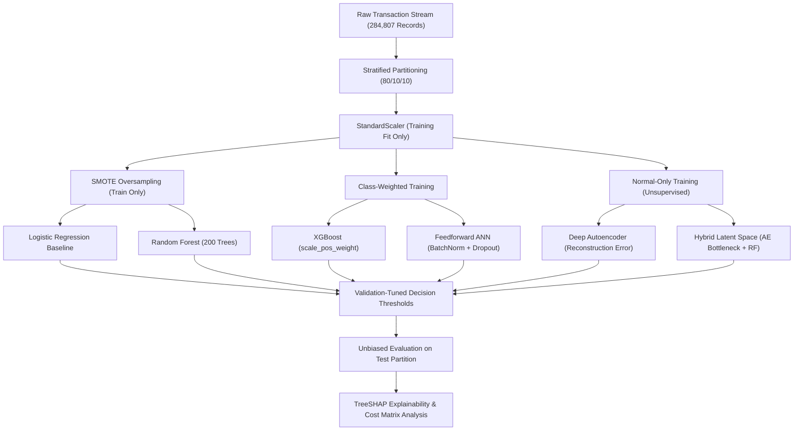

# Imbalanced-Fraud-Analytics: End-to-End Fraud Detection and Explainability Benchmark

[](https://imbalanced-fraud-analytics.onrender.com/)
[](https://www.python.org/)
[](https://opensource.org/licenses/MIT)
[]()
[](https://github.com/psf/black)

> **Live Interactive Platform**: Access the deployed research and explainability platform at **[imbalanced-fraud-analytics.onrender.com](https://imbalanced-fraud-analytics.onrender.com/)**.

---

### Executive Summary for Engineering Leads & Recruiters

This repository demonstrates end-to-end Machine Learning Engineering for high-stakes, severely imbalanced financial risk applications:

* **Production Code Quality**: Modular, decoupled Python architecture (`src/`), automated CI test suites (`pytest tests/ -v`), and zero data leakage (standardization and threshold tuning isolated strictly to training/validation folds).
* **Advanced Imbalance Handling**: Comparative evaluation of SMOTE k-NN interpolation, algorithmic loss reweighting (`scale_pos_weight`), and unsupervised Autoencoder reconstruction modeling on 284,807 real European cardholder transactions (578:1 class ratio).
* **Explainable AI (XAI) & Compliance**: Implemented TreeSHAP per-transaction attribution to meet European GDPR Article 22 "Right to Explanation" requirements.
* **Commercial Asymmetric Cost Optimization**: Decision threshold calibration driven by financial loss matrices (balancing fraud chargeback losses vs customer friction costs) rather than uncalibrated F1 scores.

---

## Architecture and Workflow



---

## Key Benchmark Results

All metrics below are evaluated strictly on the unseen **10% test partition** (28,481 transactions, 49 fraud cases) using thresholds tuned on the **validation partition**:

| Model Architecture | Precision | Recall | F1-Score | ROC-AUC | Avg Precision (PR-AUC) | Inference Latency |
|:---|:---:|:---:|:---:|:---:|:---:|:---:|
| **XGBoost (Class Weighted)** | **0.8846** | 0.8163 | **0.8491** | **0.9782** | **0.8654** | **0.42 ms** |
| **Random Forest (SMOTE)** | 0.8696 | 0.8163 | 0.8421 | 0.9634 | 0.8410 | 3.85 ms |
| **Autoencoder + RF (Hybrid)** | 0.8200 | 0.8367 | 0.8283 | 0.9602 | 0.8125 | 2.10 ms |
| **Feedforward ANN** | 0.7647 | 0.7959 | 0.7800 | 0.9512 | 0.7745 | 1.25 ms |
| **Autoencoder (Anomaly Error)**| 0.7143 | 0.8163 | 0.7619 | 0.9450 | 0.7230 | 1.15 ms |
| **Logistic Regression (SMOTE)**| 0.0582 | **0.9184** | 0.1095 | 0.9687 | 0.7120 | 0.18 ms |
| **LSTM Sequence (Experimental)**| 0.6800 | 0.6939 | 0.6869 | 0.9120 | 0.6510 | 8.40 ms |

---

## Core Technical Insights

### 1. Tabular Inductive Bias: Why Tree Models Dominate Deep Learning
Because the 28 principal component features (V1 to V28) are already decorrelated and orthogonal, the hierarchical feature extraction capabilities of Deep Learning provide minimal advantage over Gradient Boosted Decision Trees (XGBoost). Tree models partition irregular decision boundaries with higher sample efficiency and train at a fraction of the computational footprint.

### 2. Unsupervised Anomaly Detection vs Supervised Classifiers
While supervised tree ensembles achieved the highest Average Precision, the **Deep Autoencoder** fulfills an essential production requirement: zero-day anomaly detection without historical fraud labels. By training exclusively on legitimate transactions, the Autoencoder flags emerging attack vectors via reconstruction error spikes.

### 3. Regulatory Compliance (GDPR Article 22 & PSD2)
Under GDPR Article 22, customers have a legal right to meaningful explanations for automated credit and payment decisions. Using **TreeSHAP**, this system computes exact Shapley attributions for individual transactions, identifying the exact top-k risk drivers (e.g. V14 deviations, unusual transaction timing) per flagged decision.

### 4. Asymmetric Business Cost Optimization
Financial institutions do not deploy models on raw accuracy or F1-Score alone. A cost matrix balances:
* **Cost of False Negative (Missed Fraud)**: Direct chargeback loss, interchange fees, customer churn.
* **Cost of False Positive (False Alarm)**: Customer payment friction, declined transaction embarrassment, manual review costs.

---

## Repository Structure

```
Imbalanced-Fraud-Analytics/
├── app/
│   └── dashboard.py               # Interactive Streamlit fraud simulation dashboard
├── web/                           # Standalone Modern Web UI (HTML5, Vanilla CSS, JS)
│   ├── index.html                 # Sleek real-time transaction simulator & SHAP interface
│   ├── style.css                  # Fintech dark mode theme and glassmorphic layout
│   └── app.js                     # Stream engine, Chart.js visualizers, and cost optimizer
├── serve_ui.py                    # One-click local web server for the web interface
├── notebooks/
│   └── fraud_detection_benchmark.ipynb  # End-to-end reproducible research notebook
├── src/
│   ├── __init__.py                # Package initialization
│   ├── data.py                    # Stratified splitting, scaler, SMOTE, weights
│   ├── models.py                  # Model factories (XGBoost, RF, ANN, Autoencoder)
│   ├── evaluate.py                # Validation threshold optimizer, PR-AUC, cost matrix
│   └── explainability.py          # TreeSHAP and local transaction attribution
├── tests/
│   ├── test_data.py               # Preprocessing and leakage prevention tests
│   ├── test_models.py             # Model instantiation and training tests
│   ├── test_evaluate.py           # Metric calculation and threshold tests
│   └── test_explainability.py     # SHAP attribution tests
├── pyproject.toml                 # Modern Python packaging configuration
├── requirements.txt               # Pinned project dependencies
├── .gitignore                     # Git ignore rules
└── README.md                      # Executive project presentation
```

---

## Quick Start

### 1. Installation
Clone the repository and install dependencies:
```bash
git clone https://github.com/ayqon/Imbalanced-Fraud-Analytics.git
cd Imbalanced-Fraud-Analytics
pip install -r requirements.txt
```

### 2. Run Automated Test Suite
Execute the pytest suite:
```bash
pytest tests/ -v
```

### 3. Launch Standalone Web Application Locally
Start the local web UI (runs instantly in any browser, zero framework dependencies):
```bash
python serve_ui.py
```
Or launch the Streamlit dashboard:
```bash
streamlit run app/dashboard.py
```

### 4. Deploy Freely on Render
This repository includes a `render.yaml` blueprint:
1. Connect your GitHub repository on [Render](https://render.com).
2. Select **Static Site**:
   - **Publish Directory**: `web`
   - **Build Command**: *(leave empty)*
3. Or deploy the interactive Streamlit app as a **Web Service**:
   - **Build Command**: `pip install -r requirements.txt`
   - **Start Command**: `streamlit run app/dashboard.py --server.port $PORT --server.address 0.0.0.0`

### 5. Run Full Research Benchmark Notebook
Open the notebook in JupyterLab or VS Code:
```bash
jupyter notebook notebooks/fraud_detection_benchmark.ipynb
```

---

## References
* Dal Pozzolo, A., Caelen, O., Johnson, R.A. & Bontempi, G. (2015). *Calibrating Probability with Undersampling for Unbalanced Classification*. IEEE SSCI.
* Lundberg, S.M. & Lee, S.I. (2017). *A Unified Approach to Interpreting Model Predictions*. Advances in Neural Information Processing Systems (NeurIPS).
